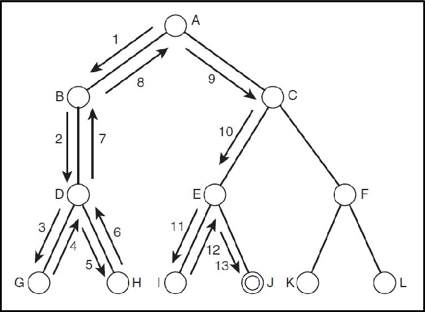

해를 찾아가는 도중, 지금의 경로가 해가 될 것 같지 않으면 그 경로를 더이상 가지 않고 되돌아갑니다.

즉, 코딩에서는 반복문의 횟수까지 줄일 수 있으므로 효율적입니다.

이를 가지치기라고 하는데, 불필요한 부분을 쳐내고 최대한 올바른 쪽으로 간다는 의미입니다.

일반적으로, 불필요한 경로를 조기에 차단할 수 있게 되어 경우의 수가 줄어들지만, 만약 N!의 경우의 수를 가진 문제에서 최악의 경우에는 여전히 지수함수 시간을 필요로 하므로 처리가 불가능 할 수도 있습니다. 가지치기를 얼마나 잘하느냐에 따라 효율성이 결정되게 됩니다.

