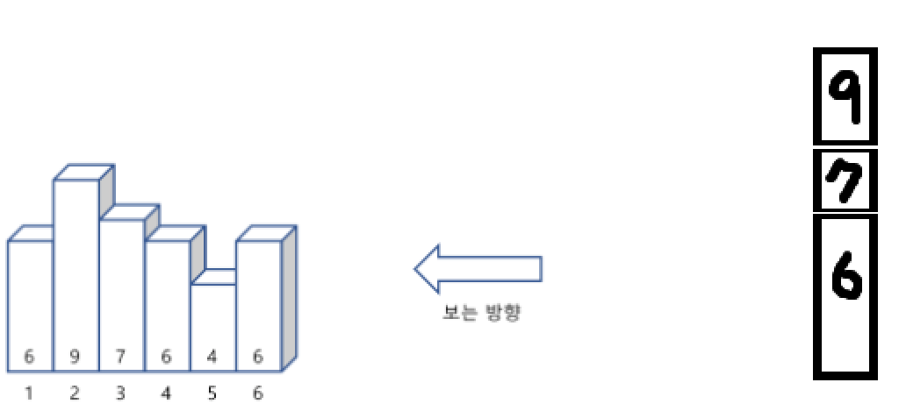

<a href="https://www.acmicpc.net/problem/17608">막대기</a>

1. 문제 내의 변수.
- 막대기의 개수 : N
- 막대기 배열 : int[] arr

2. 구현   
방법 1 [ 배열 사용 ]  
- 막대기 갯수와 막대기 높이를 왼쪽부터 받아 arr[]에 입력
- 막대기를 오른쪽에서 본다고 가정하면 아래와 같은 모양이 나옴    

- 즉 오른쪽 기준에서 봤을 때 막대기가 같거나 작으면 보이지 않음
- 최고 길이의 막대기 (변수 : recentTallerBlock) 를 두고 큰 막대기가 나오면 보이는 막대기 갯수에 1을 증가 시킴
- 최대 길이의 막대기를 갱신시켜 줌
 